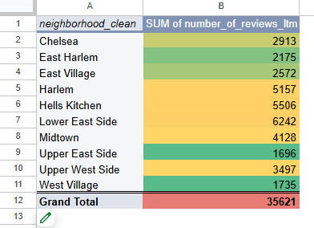
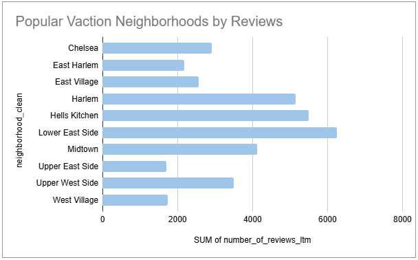

# 🗽 Project 1: Manhattan Vacation Rental Market Analysis

## 🧭 Project Overview  
The goal of this project was to help a client evaluate investment opportunities in the Manhattan vacation rental market. Using Airbnb listing and booking data, I provided recommendations on which **neighborhoods** and **property sizes** (i.e., number of bedrooms) were the most attractive for short-term rentals, based on rental popularity and potential revenue.

The project involved cleaning raw datasets, performing pivot table analysis, creating visualizations, and estimating annual revenue for top-performing listings. Key assumptions, such as using the number of reviews in the last 12 months (`number_of_reviews_ltm`) as a proxy for rental frequency, were documented to ensure a transparent analytical process.

---

## 🧠 Business Questions Answered

- 📍 Which neighborhoods in Manhattan are most attractive for vacation rentals?
- 🛏️ Which property sizes (number of bedrooms) are most popular for short-term rentals?
- 🧩 Do different neighborhoods prefer different property sizes?
- 💰 How much potential annual revenue could top listings generate?

---

## 🛠️ Key Tasks and Methodology

<h3>
  🧹 Data Cleaning
  
</h3>
- Standardized inconsistent neighborhood names (`neighborhood_clean` column)  
- Reclassified empty bedroom values as studio apartments (`bedrooms_clean` column)

---

### 📊 Analysis  
- Built pivot tables to identify the top 10 neighborhoods based on review counts  
- Analyzed the popularity of different property sizes across neighborhoods  
- Filtered listings to focus on the most attractive property type per neighborhood  

---

### 💵 Revenue Estimation  
- Created a `revenue_earned` column in the calendar dataset by identifying available nights and corresponding nightly prices  
- Aggregated 30-day revenue and extrapolated to estimate annual revenue for top listings  
- Identified the highest-earning listing based on total revenue earned  

---

### 📈 Visualization  
- Produced a bar chart showing the number of reviews for the top 10 neighborhoods  

---

## 💡 Key Findings
- 🏙️ **Top 3 Most Attractive Neighborhoods**: Harlem, Hell's Kitchen, and Lower East Side  
- 🛌 **Most Popular Property Sizes**: Studios, 1-bedrooms, and 2-bedrooms  
- 🧭 Harlem showed a particular preference for 1-bedroom properties  
- 💸 The highest-earning listing (ID: `5525510`) had the potential to generate substantial annual income based on observed revenue

---

## 🧰 Tools Used
- Google Sheets (Pivot Tables, `SUMIF`, `IF` functions, Data Cleaning)  
- Google Sheets Charts for visualization  

---

## 📦 Deliverables
- Executive Summary with business recommendations  
- Table of Contents for easy navigation  
- Cleaned and well-documented spreadsheets  
- Change log detailing all data transformations  
- Revenue estimation model based on real calendar data  

---

## 🔗 Project Link  
👉 [View Full Project Spreadsheet](https://docs.google.com/spreadsheets/d/4d1iIDEs6pesBCbMy85jE8oC7uw5jKz-iM7GCzIo7e7s/edit?usp=sharing)
