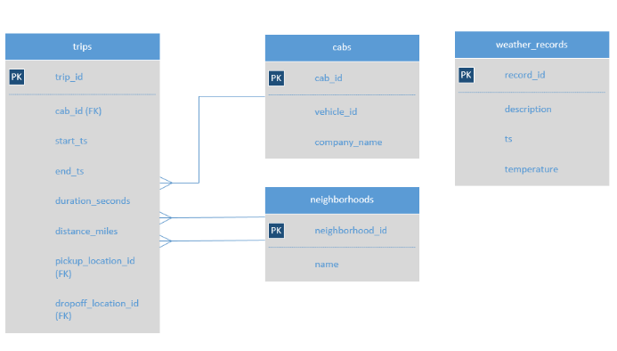

# 🚕 Project 2: Zuber Ride-Sharing Analysis (A/B Test Analysis for Food Delivery Startup)

## 🧭 Project Overview
The objective of this project was to analyze ride-sharing data for **Zuber**, a new ride-sharing company in Chicago.  
The goal was to identify patterns in passenger behavior, understand taxi company competition, and evaluate the impact of **rainy weather** on ride duration from the city center to the airport.

The project involved querying a **SQL database** containing taxi trip data, company information, neighborhood details, and weather records. Hypotheses were tested using structured queries and aggregations to uncover insights about ride patterns under different weather and time conditions.

  

---

## 🧠 Business Questions Answered
- 🚖 Which taxi companies were dominant in Chicago during November 2017?
- 💛 How does the number of rides differ for companies with "Yellow" or "Blue" in their names?
- 📊 What share of rides is captured by Flash Cab and Taxi Affiliation Services versus other companies?
- 🌧️ Does rainy weather impact ride duration from the Loop to O'Hare International Airport on Saturdays?

---

## 🛠️ Key Tasks and Methodology

### 🔍 Exploratory Data Analysis
- Aggregated and compared ride counts across companies for specific date ranges
- Identified market leaders and compared ride volumes between major companies and others

### ☔ Weather Impact Analysis
- Created a binary weather classification (`Good` vs `Bad`) based on weather descriptions
- Merged ride and weather data on hourly timestamps
- Focused specifically on Saturday trips from the Loop (Neighborhood ID: 50) to O'Hare Airport (Neighborhood ID: 63)

### 🧮 SQL Techniques Used
- Aggregations (`COUNT`, `GROUP BY`)
- CASE WHEN statements for weather categorization
- JOIN operations across multiple tables
- Filtering using `LIKE` statements and date functions

---

## 💡 Key Findings
- 🏆 **Flash Cab** and **Taxi Affiliation Services** emerged as dominant players in the Chicago ride-sharing market.
- 📉 Ride patterns showed significant dominance by a few key companies.
- 🌧️ Rides taken during rainy (`Bad`) weather conditions had longer median durations from the Loop to O'Hare on Saturdays compared to rides during `Good` weather.

---

## 🛠️ Tools Used
- 🛢️ SQL (PostgreSQL)
- ☁️ Google BigQuery / TripleTen’s Cloud SQL environment

---

## 📦 Deliverables
- 🧹 SQL queries for data retrieval and analysis
- 🛠️ Data cleaning and transformation scripts
- 📈 Final insights presented through query results and pivot tables

---

## 🔗 Project Link
👉 [View SQL Analysis Files](./exploratory_analysis.sql)
