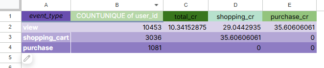
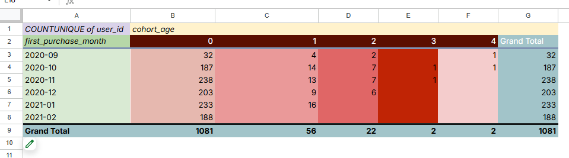
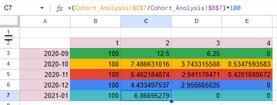
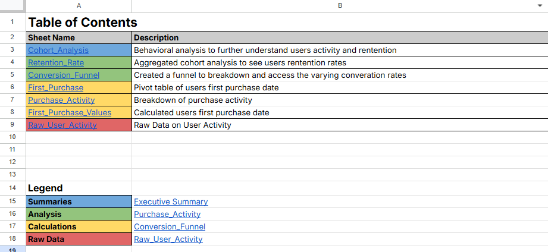

# 💻 Project 3: E-Commerce Business Conversion Funnel Analysis

## 📊 Project Overview  
As a Junior Data Analyst at an e-commerce company, I was tasked with analyzing raw user activity logs to derive critical business metrics. The project focused on building a **conversion funnel** to measure the site's ability to turn page views into purchases and preparing **cohort analyses** to track user retention over time.

The analysis required data cleaning, pivot table creation, formula building, and professional spreadsheet structuring to deliver executive-level insights.

  

---

## 🧠 Business Questions Answered   

- 🛒 How efficiently does the website convert visitors into paying customers? 
- 👥 What is the overall user retention rate by monthly acquisition cohort?  
- 🔁 How do user behaviors change over time from their initial purchase?

---

## 🛠️ Key Tasks and Methodology

  

    <h3>🔻 Conversion Funnel Analysis</h3>
    <ul>
      <li>Created a three-step funnel tracking unique users across product page views, cart openings, and completed purchases</li>
      <li>Calculated total and step-by-step conversion rates</li>
    </ul>
  

  

  

    <h3>🗓️ Cohort Analysis Preparation</h3>
    <ul>
      <li>Isolated purchase activities from raw event data</li>
      <li>Calculated each user's first purchase date using <code>VLOOKUP</code> and pivot tables</li>
      <li>Generated monthly event and acquisition cohorts using <code>TEXT</code> and <code>DATEDIF</code> functions</li>
    </ul>
  

  

  

    <h3>📉 Cohort Retention Rates</h3>
    <ul>
      <li>Aggregated users by acquisition month and tracked retention across 1–4 month periods</li>
      <li>Created a retention matrix with percentage retention rates month-over-month</li>
    </ul>
  

  

  

    <h3>📋 Executive Summary and Documentation</h3>
    <ul>
      <li>Wrote a clear executive summary and documented all data assumptions</li>
      <li>Organized sheets into a logical structure with a 📑 Table of Contents</li>
      <li>Formatted spreadsheets for readability: <strong>bold headers</strong>, frozen rows, borders, and clean formatting</li>
    </ul>
  

  

---

## 💡 Key Findings

### 📉 Conversion Funnel  
- Major drop-offs found between product page views and purchases  
- Recommendations made to improve cart-to-purchase conversions

### 🔄 User Retention  
- Strongest retention seen in the first 1–2 months  
- Drop-offs by month 3–4 highlighted opportunities for re-engagement

---

## 🧰 Tools Used  
- Google Sheets (`Pivot Tables`, `VLOOKUP`, `TEXT`, `DATEDIF`, `SUMIF`)  
- Advanced formatting and dashboard organization

---

## 📦 Deliverables  
- 📝 Executive Summary with insights and assumptions  
- 🔻 Conversion Funnel chart  
- 🧩 Cohort Analysis pivot table  
- 📈 Retention Rates matrix  
- 🗂️ Well-documented and structured workbook

---

## 🔗 Project Link  
👉 [Business Analytics Project Workbook (Google Sheets)](https://docs.google.com/spreadsheets/d/1oAUyNNN33sJlqYmQeiYw9qTYKIp4PnJaOq_iziPXiRw/edit?usp=sharing)
