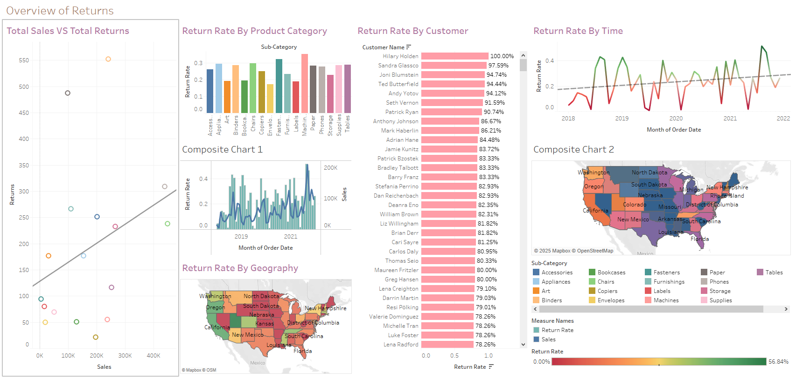
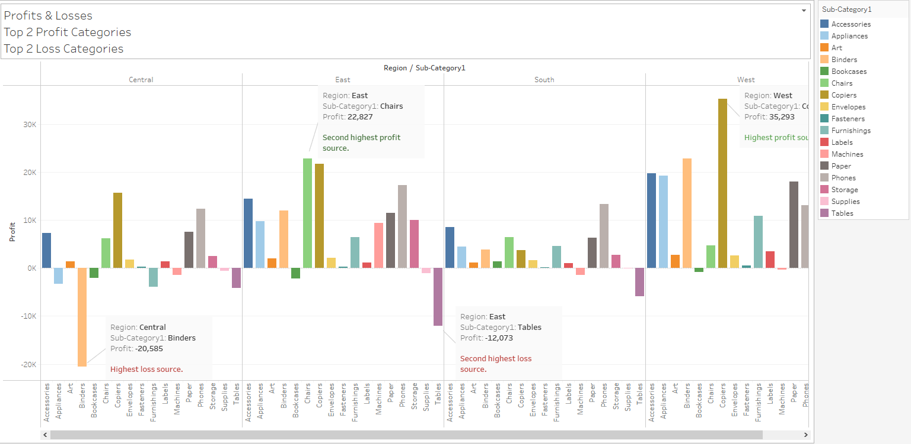

# 🏬 Project 4: Superstore Business Health Analysis

## 🧭 Project Overview  
As a consultant hired to save a struggling superstore from bankruptcy, my task was to identify operational inefficiencies and profitability issues through advanced data analysis and visualization. This project focused on pinpointing **profit centers**, optimizing **product strategy**, identifying **advertising opportunities**, and analyzing **return rates** to inform critical business decisions.

Each business question was answered using well-justified visualizations built from the Superstore dataset.

---

## 🧠 Business Questions Answered  
- 💰 Which combinations of dimensions generate the most profits and the biggest losses?  
- 🚫 Which specific products and subcategories should the superstore stop selling?  
- 📍 Which states and months should the superstore target for advertising based on profitability?  
- 🔁 Which products and customers have the highest return rates?  
- 📉 How do profit and return rates correlate across different operational dimensions?

---

## 🛠️ Key Tasks and Methodology

### 📊 Profitability Analysis  
- Analyzed profitability across dimension pairs (subcategory + region, shipping mode + product)  
- Identified top 2 profit drivers and top 2 loss drivers  
- Recommended products and subcategories to discontinue or double down on

### 📣 Advertising Strategy  
- Evaluated monthly profit trends by state  
- Pinpointed 3 best state + month combinations for advertising  
- Calculated max ad spend using a 1/5 profit ratio

### 🚨 Returned Items Analysis  
- Merged Returns and Orders data via LEFT JOIN  
- Created a calculated return field (`0` for no, `1` for yes)  
- Visualized return rates by product and customer  
- Analyzed correlation between return rate and profit by category
  

---

## 💡 Key Findings

### ✅ Profit and Loss Centers  
- Certain subcategory-region combos were driving the largest profits and losses  
- A small group of products accounted for disproportionate losses

### 🧾 Product Strategy  
- Recommended discontinuing underperformers and expanding best-selling subcategories

### 🎯 Advertising Opportunities  
- Identified states and months with strong ROI potential for ad targeting

### 🔄 Return Risk Insights  
- Highlighted products and customers with high return rates  
- Found profit-to-return rate imbalances in specific segments

---

## 🧰 Tools Used  
- 📊 Tableau 
- 📋 Data storytelling and visualization best practices

---

## 📦 Deliverables  
- 📈 Profitability visualizations by category and region  
- 🧩 Product & subcategory performance recommendations  
- 📍 Ad targeting plan by state and month + budget caps  
- 🔁 Return rate analysis by product and customer  
- 🔄 Profit vs. return correlation charts  
- 🧑‍💼 Executive-ready dashboard and summary

---

## 🔗 Project Link  
👉 [View Full Project Workbook or Dashboard](https://public.tableau.com/views/README_md3/SuperstoreAnalysis?:language=en-US&publish=yes&:sid=&:redirect=auth&:display_count=n&:origin=viz_share_link)

