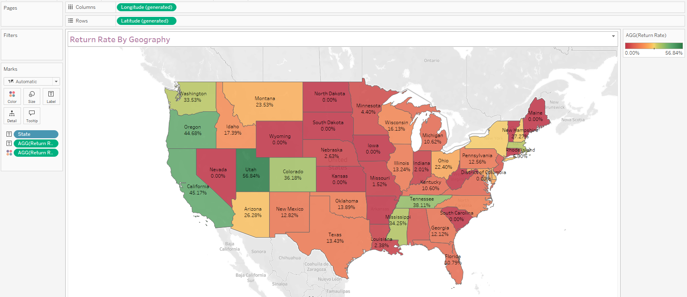
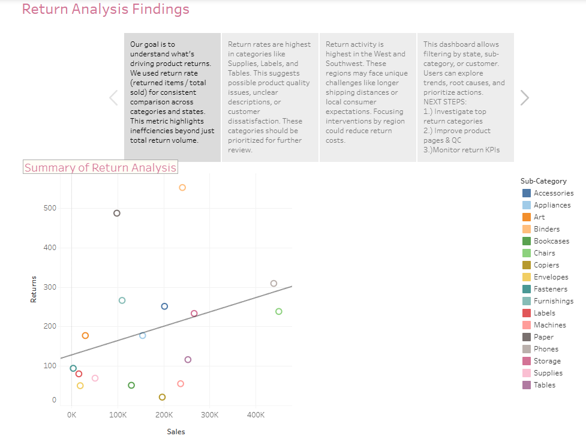

# 📦 Project 5: Root Cause Analysis of Returned Orders

## 🧭 Project Overview
This project explores the root causes of returned orders at the Superstore. As a data analyst, my goal was to help the CEO understand **what is driving high return rates** and how to **reduce the volume and impact of returns** across key products, customers, and regions. I conducted return rate analysis using Tableau and designed an interactive dashboard to support ongoing monitoring and decision-making.

---

## ❓ Key Business Questions
- 📦 What types of products are being returned most frequently?
- 👥 Are return rates linked to specific customers or customer behaviors?
- 🌍 Are certain regions or time periods more prone to returns?
- 💰 How do returns correlate with total sales or profitability?
- 🔍 What composite trends point to deeper root causes?

---

## 🛠️ Methodology

### 📊 Return Metrics Preparation
- Merged `Returns` table to `Orders` table using a **LEFT JOIN**.
- Created a calculated field `Returned_flag`:
  - `1` if order was returned
  - `0` if not
- Used this field to calculate:
  - **Return Rate** (average of `Returned_flag`)
  - **Total Returns** (sum)
  - **Return Cost Impact** (optional insight)

---

## 📈 Worksheets Created

### 1. 🔄 Correlation Between Sales and Returns
- **Scatterplot** by Product Subcategory
- Shows whether higher sales correlate with higher returns

### 2. 📊 Return Rate by Product Category
- **Bar chart** ranking each category by average return rate

### 3. 👤 Customer-Level Return Rate
- Filtered to show only customers with more than one order
- Identifies individuals prone to excessive returns

### 4. 🗺️ Return Rate by Geography
- **Map visualization** showing return concentrations by state

### 5. 📅 Return Rate by Time
- **Line chart** showing monthly return trends
- Highlights possible seasonal effects

### 6. 🔀 Composite Charts (x2)
- Mixed views (e.g., return rate by month AND category)
- Designed to surface hidden multi-variable patterns

---

## 🖥️ Dashboard Design Process

### ✏️ Mockups & Layout Planning
- Created 3 low-fidelity dashboard sketches on paper
- Chose the strongest layout based on storytelling impact

### 🧱 Dashboard Template
- Built a layout using containers and spacing
- Included interactive filters and clear KPIs

### ✅ Final Dashboard Features
- All key worksheets added and arranged logically
- Dashboard title, filters, legends, and tooltips finalized
- Explains insights clearly for non-technical users

---

## 📖 Tableau Story Presentation

### 🧭 Story Arc
- Defined return rate vs. return count vs. return cost
- Identified key trends and root causes
- Walked through dashboard filters and use cases
- Proposed actions (e.g., product delisting, customer review, regional training)

### 💡 Business Recommendations
- 🚩 Flag high-risk customers for review or policy changes
- 🛍️ Remove or repackage high-return subcategories
- 📍 Launch targeted return reduction efforts in problem states
- 📊 Use dashboard for quarterly monitoring and decision-making

---

## 🧰 Tools Used
- 📊 Tableau (Data joins, calculations, dashboarding, storytelling)
- 📄 Excel (Data cleanup and JOIN prep)

---

## 📈 Outcome
This project delivered a repeatable method to identify, track, and act on return risks across the business. It gives Superstore leadership the tools needed to reduce return-related losses and improve customer experience.

---

## 🔗 Project Links
- 📊 [View Interactive Dashboard on Tableau Public](https://public.tableau.com/views/Book2_2_17448546571110/ShopifyAnalysis?:language=en-US&publish=yes&:sid=&:redirect=auth&:display_count=n&:origin=viz_share_link)
- 📖 [View Full Story Presentation (with captions)](https://public.tableau.com/views/Book2_2_17448546571110/Story1?:language=en-US&publish=yes&:sid=&:redirect=auth&:display_count=n&:origin=viz_share_link)

