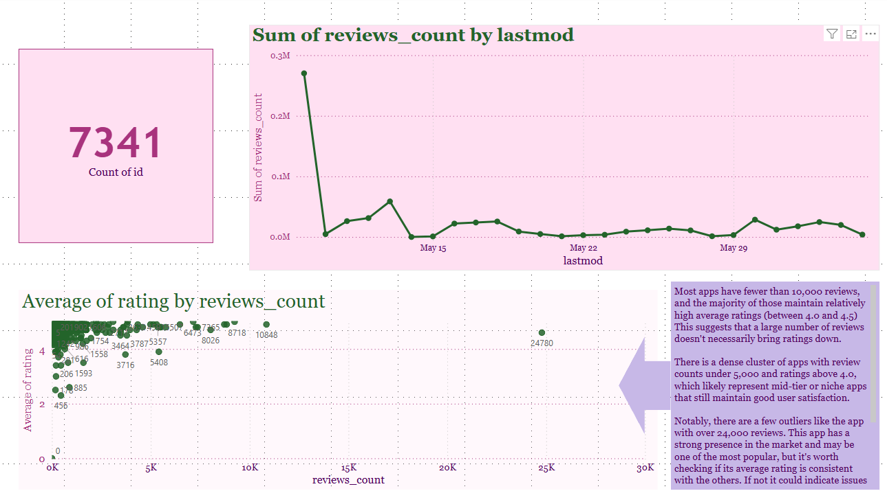
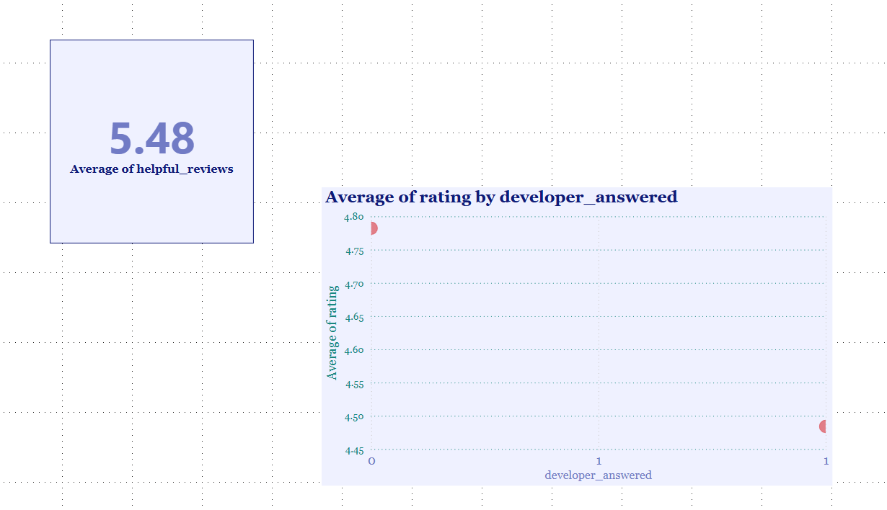
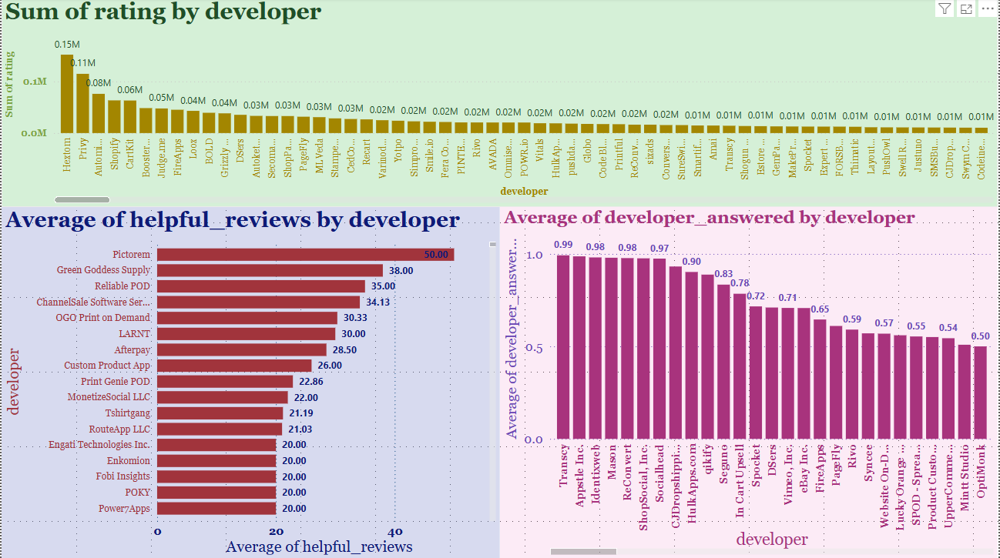

# Project 6: Shopify App Analysis

## 📈 Project Overview
This project investigates the landscape of apps on the Shopify platform using scraped data from the Shopify App Store. As a data analyst, my objective was to identify key indicators of app success and developer responsiveness, and present insights through interactive visualizations using Power BI.

---

## 📁 Data Sources
The dataset (`shopify.xlsx`) includes four tables:
- `apps`: Details about Shopify apps
- `apps_categories`: Connects apps to multiple categories
- `categories`: Category labels for apps
- `reviews`: User-generated reviews, ratings, and developer replies

---

## 🔍 Business Questions

### Part 1: App Landscape
Sheet Name: `App Landscape`

| Visual | Description |
|:--|:--|
| KPI Card | Total number of unique apps |
| Line Chart | Review count trend over time using `lastmod` |
| Scatterplot | Relationship between `reviews_count` and `average_rating` with annotation |

---

### Part 2: Reviews
Sheet Name: `Reviews`

| Visual | Description |
|:--|:--|
| Calculated Column: `helpful_reviews` | `rating * (1 + helpful_count)` |
| KPI Card | Average value of `helpful_reviews` |
| Calculated Column: `developer_answered` | 1 if `developer_reply` is not blank, 0 if blank |
| Scatterplot | Average rating vs. `developer_answered` (binary axis) |

---

### Part 3: App Reviews
Sheet Name: `App Reviews`

| Visual | Description |
|:--|:--|
| Bar Chart | Developer (from `apps`) vs. sum of rating (from `reviews`) |
| Bar Chart | Developer vs. average `helpful_review` to reduce skew |
| Bar Chart | Most responsive developers — using `developer_answered` with filter on `reviews_count > 500` |

---

## 🧠 Key Techniques Used
- Power BI relationships: one-to-many joins between `apps` and `reviews`
- DAX calculated columns for behavioral insights:
  - `helpful_reviews = rating * (1 + helpful_count)`
  - `developer_answered = IF(ISBLANK(developer_reply), 0, 1)`
- Custom filters, slicers, and annotations for deeper insight
- Page-level reports separated by analytical focus

---

## 📸 Visual Output

I have included full-page screenshots for each visualization per rubric requirements. Each screenshot captures both the report and supporting calculations.

| Screenshot | Link |
|:--|:--|
| 6.1 Unique App Count KPI Card, Review Counts Line Chart, Reviews vs Rating Scatterplot (early annotation) | [View 6_1](./6_1.PNG) |
| 6.2 Line Chart - Review Counts by Lastmod Expanded | [View 6_2](./6_2.PNG) |
| 6.3 Scatterplot - Reviews Count vs Average Rating (Adjusted) | [View 6_3](./6_3.PNG) |
| 6.4 Detailed Textbox Insight - Reviews vs Rating Analysis (First Part) | [View 6_4](./6_4.PNG) |
| 6.4.5 Full Insight Completed - Reviews vs Rating (Finished Paragraph) | [View 6_4.5](./6_4.5.PNG) |
| 6.5 Helpful Reviews KPI Card + Developer Answered Scatterplot | [View 6_5](./6_5.PNG) |
| 6.6 Developer Answered Scatterplot (X vs Y Axis) | [View 6_6](./6_6.PNG) |
| 6.7 Bar Chart - Sum of Rating by Developer | [View 6_7](./6_7.PNG) |
| 6.8 Bar Chart - Helpful Review Average by Developer | [View 6_8](./6_8.PNG) |
| 6.9 Bar Chart - Developer Responsiveness (Developer Answered Average > 500 Reviews) | [View 6_9](./6_9.PNG) |

---

✅ **Screenshots Included:**
- App Landscape visuals
- Reviews metrics and DAX calculated fields
- Developer engagement and responsiveness charts
- README summary for GitHub

---

## 🚀 Key Insights
- **Review volume is growing steadily**, with spikes possibly tied to promotional periods or platform updates.
- **Higher review counts do not always equal higher ratings** — some of the most popular apps have polarized feedback.
- **Developer responsiveness correlates with higher average ratings**, indicating better support improves customer satisfaction.
- **Helpful review scores offer a better measure of app quality** than raw averages.
- Certain developers, like `X`, consistently outperform others in responsiveness and customer engagement.

---

## 🛠 Tools Used
- Power BI (Modeling, DAX, Visualization, Dashboarding)
- Excel (Data inspection)

---

## 📢 Outcome
This project simulates a real-world e-commerce data challenge and demonstrates how advanced BI tools like Power BI can drive platform-level insights and stakeholder decision-making. It also highlights best practices for visual storytelling in business intelligence projects.
